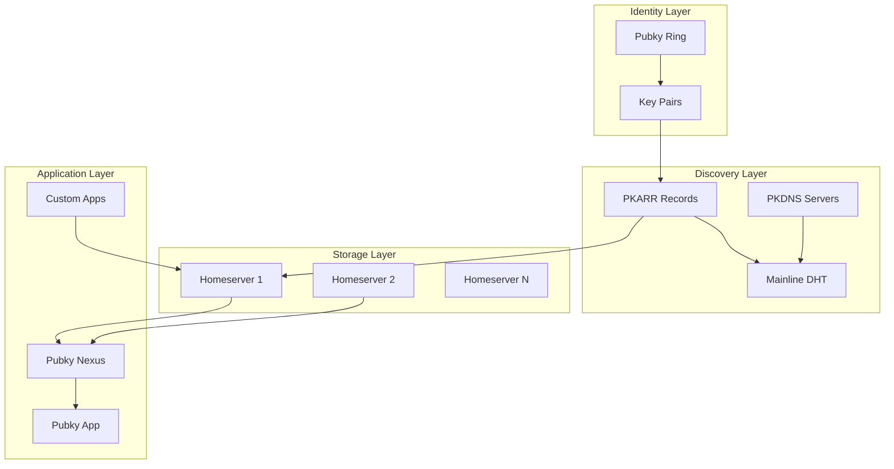
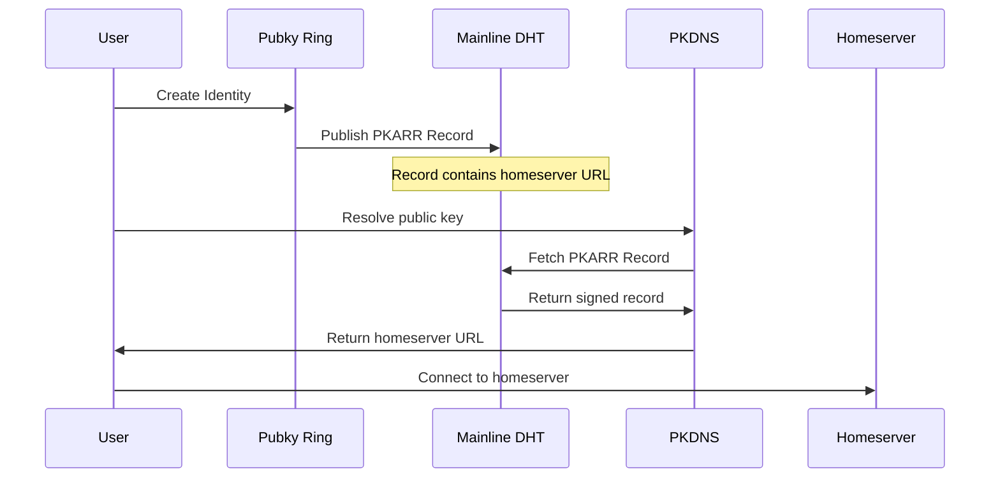
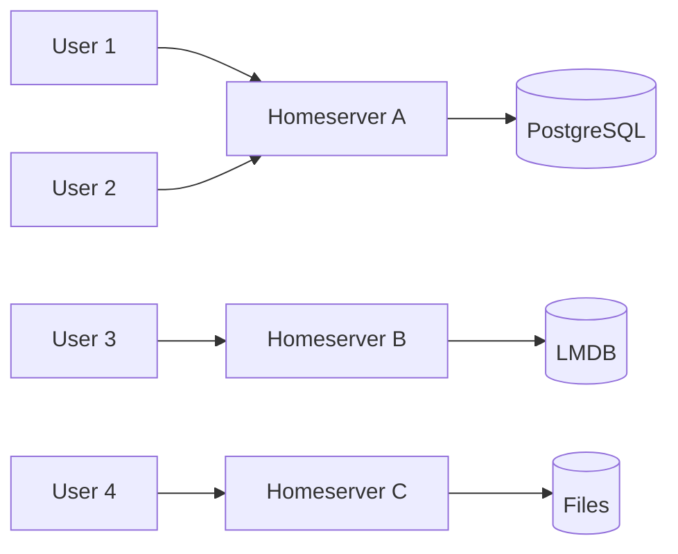
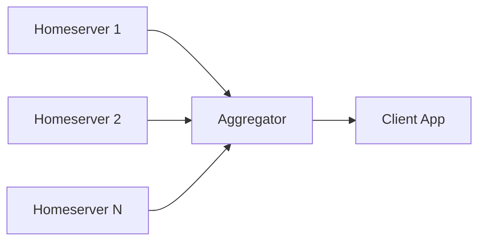
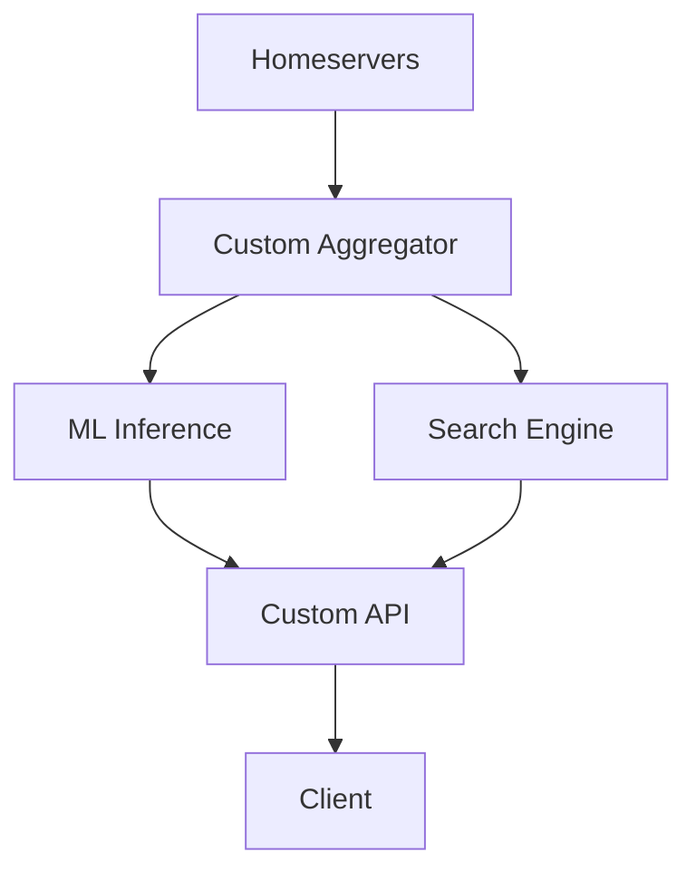
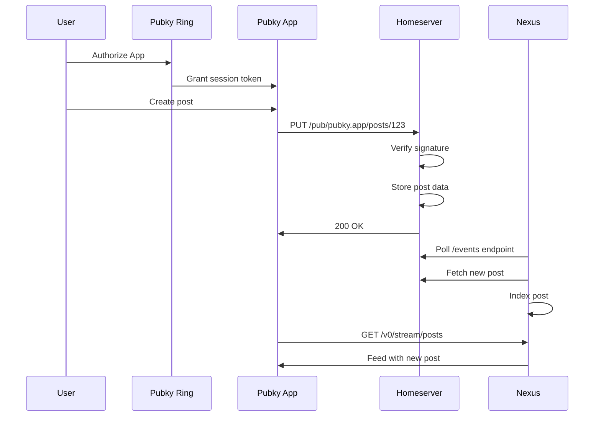

# Pubky Architecture Overview

This page provides a comprehensive overview of the Pubky ecosystem architecture, showing how all components work together to enable decentralized, censorship-resistant applications.

---

## System Architecture



---

## Layer Breakdown

### Identity Layer

The foundation of Pubky is cryptographic identity based on **[[Key Pair|key pairs]]**.

**Components:**
- **[[Explore/Technologies/Pubky Ring|Pubky Ring]]**: Mobile app for secure key management
- **Key Pairs**: Ed25519 public/private key pairs
- **Recovery Files**: Encrypted backups for key recovery

**How It Works:**
1. User generates a key pair (public + private key)
2. Public key becomes permanent identity (z-base-32 encoded)
3. Private key stays secure on device, used for signing
4. Recovery file enables backup and cross-device usage

**Key Properties:**
- ✅ Self-sovereign (no registration with authorities)
- ✅ Portable across devices
- ✅ Permanent (never changes)
- ✅ Cryptographically secure

---

### Discovery Layer

The discovery layer enables finding homeservers and resolving identities without central servers.

**Components:**
- **[[0.Introduction|PKARR]]**: Public Key Addressable Resource Records
- **[[Mainline DHT]]**: Distributed Hash Table (10M+ nodes)
- **[[PKDNS]]**: DNS servers for resolving public key domains

**How It Works:**



**Key Features:**
- Decentralized discovery (no central directory)
- Censorship resistant (15+ years proven infrastructure)
- Self-published (users control their records)
- Updateable (switch homeservers anytime)

---

### Storage Layer

**[[Homeservers]]** store user data in a key-value format over HTTP/HTTPS.

**Architecture:**



**Key Properties:**
- **User Choice**: Pick any homeserver or run your own
- **Data Ownership**: You control your data
- **Portability**: Switch homeservers without losing data
- **Persistence Backends**: Files, LMDB, PostgreSQL, or SQL

**API Operations:**
- `PUT /pub/app/path` - Store data
- `GET /pub/app/path` - Retrieve data
- `DELETE /pub/app/path` - Delete data
- `LIST /pub/app/` - List directory

---

### Application Layer

Applications consume data from homeservers, either directly or through aggregation services.

**Architecture Patterns:**

#### 1. Simple Client-Homeserver


**Use Case**: Personal apps, simple tools, direct data access

#### 2. Global Aggregator



**Use Case**: Social feeds, search, discovery (e.g., [[Explore/Pubky App/Backend/Pubky Nexus|Pubky Nexus]])

#### 3. Custom Backend



**Use Case**: Advanced features, recommendations, specialized processing

---

## Data Flow Example: Publishing a Post



---

## Component Responsibilities

### Pubky Core

**[[Explore/Pubky Core/Introduction|Pubky Core]]** provides:
- Protocol specification
- Homeserver implementation
- SDK for all platforms
- Authentication system
- API standards

**Repository**: [github.com/pubky/pubky-core](https://github.com/pubky/pubky-core)

### Pubky Ring

**[[Explore/Technologies/Pubky Ring|Pubky Ring]]** handles:
- Key generation and storage
- App authorization
- Session management
- Recovery file creation

**Platforms**: iOS, Android (React Native)

### Pubky Nexus

**[[Explore/Pubky App/Backend/Pubky Nexus|Pubky Nexus]]** provides:
- Real-time aggregation
- Social graph indexing
- Search and discovery
- High-performance API

### PKDNS

**[[PKDNS]]** enables:
- Public key domain resolution
- DNS-over-HTTPS support
- Traditional ICANN domain support
- Self-hosted or public instances

**Repository**: [github.com/pubky/pkdns](https://github.com/pubky/pkdns)

### Homegate

**[[Homegate]]** provides:
- SMS verification
- Lightning payment verification
- Spam prevention
- Privacy-preserving signup

**Repository**: [github.com/pubky/homegate](https://github.com/pubky/homegate)

---

## Infrastructure Tools

### Development Tools

- **[[Explore/Technologies/Pubky Docker|Pubky Docker]]**: Full stack in one command
- **[[Explore/Technologies/Pubky CLI|Pubky CLI]]**: Command-line homeserver management
- **[[Explore/Technologies/Pubky Explorer|Pubky Explorer]]**: Web-based data browser

### Work in Progress

- **[[Explore/Technologies/Paykit|Paykit]]**: Payment protocol
- **[[Explore/Technologies/Pubky Noise|Pubky Noise]]**: Encrypted communication

---

## Security Model

### Authentication

See [[Authentication]] for the full authentication flow.

### Data Integrity

**All data operations are signed:**
1. Client creates data
2. Client signs hash with private key
3. Homeserver verifies signature
4. Data stored with signature
5. Anyone can verify authenticity

### Trust Model

**What you trust:**
- ✅ Mathematics (cryptography)
- ✅ Your own keys
- ⚠️ Your homeserver for availability (not integrity)

**What you DON'T trust:**
- ❌ Central authorities
- ❌ DNS registrars
- ❌ Server operators to verify data (math does it)

---

## Scalability Characteristics

### Horizontal Scaling

| Component | Scaling Method |
|-----------|----------------|
| **Homeservers** | Add more servers, users distribute naturally |
| **PKDNS** | Run multiple instances, cache aggressively |
| **Nexus** | Shard by user/data type, read replicas |
| **Mainline DHT** | Already 10M+ nodes, proven at scale |

### Performance Metrics

**Typical Latencies:**
- PKARR lookup (cached): < 100ms
- PKARR lookup (DHT): 500-2000ms
- Homeserver GET: 50-200ms
- Nexus API: 10-50ms (sub-millisecond for cached)

---

## Comparison to Other Architectures

### vs Traditional Web (Client-Server)

| Aspect | Traditional | Pubky |
|--------|-------------|-------|
| Identity | Username@service | Public key (permanent) |
| Data Storage | Company servers | User-chosen homeservers |
| Portability | Locked-in | Full portability |
| Censorship | Easy | Very difficult |

### vs Blockchain

| Aspect | Blockchain | Pubky |
|--------|-----------|-------|
| Fees | Transaction fees | None |
| Speed | Slow (blocks) | Instant (HTTP) |
| Storage | Expensive | Cheap (standard hosting) |
| Scalability | Limited | Web-scale |

### vs Pure P2P

| Aspect | Pure P2P | Pubky |
|--------|----------|-------|
| Availability | Must be online | Homeservers always on |
| Mobile-Friendly | Difficult | Native support |
| Performance | Variable | Consistent |
| Discovery | Complex | DHT + PKDNS |

---

## Deployment Patterns

### Personal Use

```
User Device → Pubky Ring → Personal Homeserver
```

**Best for**: Personal data, backups, full control

### Small Team

```
Team Members → Shared Homeserver → Team Apps
```

**Best for**: Collaborative projects, startups

### Social Application

```
Users → Public Homeservers → Nexus Aggregator → Social App
```

**Best for**: Social media, discovery platforms

### Enterprise

```
Users → Enterprise Homeserver + Custom Aggregator + Private Nexus → Internal Apps
```

**Best for**: Organizations with custom requirements

---

## See Also

- **[[Getting Started]]**: Get started with Pubky
- **[[Explore/Pubky Core/Introduction|Pubky Core Overview]]**: Protocol details
- **[[Explore/Pubky Core/SDK|SDK Documentation]]**: Build applications
- **[[Explore/Pubky Core/API|API Reference]]**: HTTP API specification
- **[[Comparisons]]**: How Pubky differs from alternatives
- **[[FAQ]]**: Frequently asked questions

