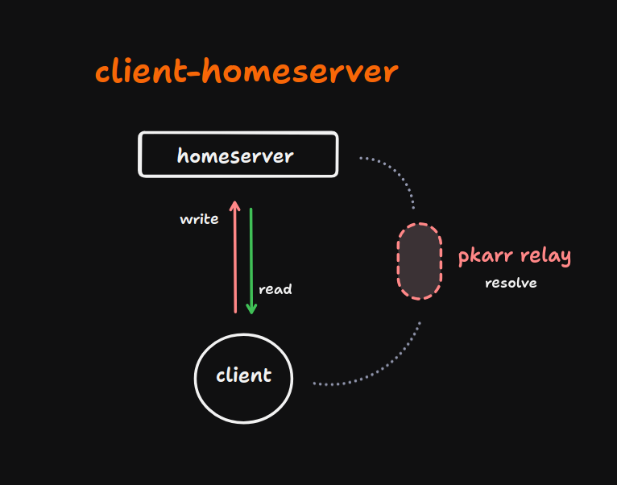

In this architecture, we implement a direct communication model between the client application and the home server, eschewing intermediate layers. This approach minimizes latency and reduces system complexity by establishing a direct data flow pathway.

This design pattern is particularly well-suited for applications with straightforward functionality, especially those that don't require real-time interaction or data normalization. This architectural approach demonstrates optimal performance in use cases characterized by intermittent data operations, where asynchronous read/write cycles are adequate for maintaining data consistency and fulfilling application requirements.

To illustrate the practical applications of this architectural paradigm, consider the following implementation scenarios:

1. Bookmark Management System: A client application designed to store and retrieve user bookmarks directly from the home server.
2. File Synchronization Utility: Similar to the open-source [Syncthing](https://syncthing.net/) project, this type of application would facilitate direct file synchronization between the client and the home server.
3. Text Snippet Repository: A lightweight application for creating, storing, and retrieving short text fragments or code snippets as [pastebin](https://pastebin.com/)

These implementations leverage the Pubky Core protocol to establish secure, efficient, and direct data exchange channels between the client and the home server, optimizing performance for their specific use cases.
