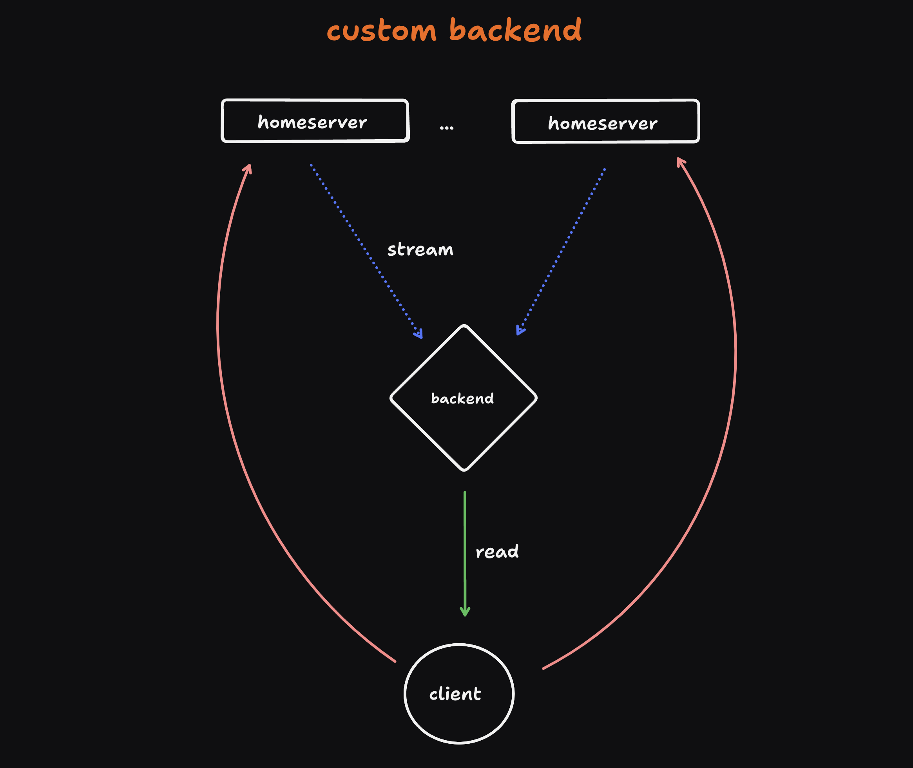

This architectural design introduces a more sophisticated data flow model, incorporating an intermediary backend layer between the client application and the home server. This backend functions as a middleware, enhancing the system's flexibility and data processing capabilities.

The backend layer comprises with many components, this components set the client needs, but this are the main ones

1. __Indexer__: Responsible for data normalization, ensuring consistent data structures and optimizing query performance.
2. __Aggregator__: Implements event filtering logic, allowing for selective data propagation based on predefined criteria.

This architecture supports two distinct data consumption patterns:

a) For scenarios requiring both data normalization and event filtering, the client interacts with the backend layer, as an endpoint. The aggregator processes the event stream from the home server(s), applying filtering rules before passing the data to the indexer for normalization.

b) In cases where only data normalization is necessary, the backend can bypass or not implement the aggregator, consuming events directly from the home server via the indexer.

This modular approach allows for fine-grained control over data processing, enabling efficient resource utilization and optimized client-side performance based on specific application requirements.

