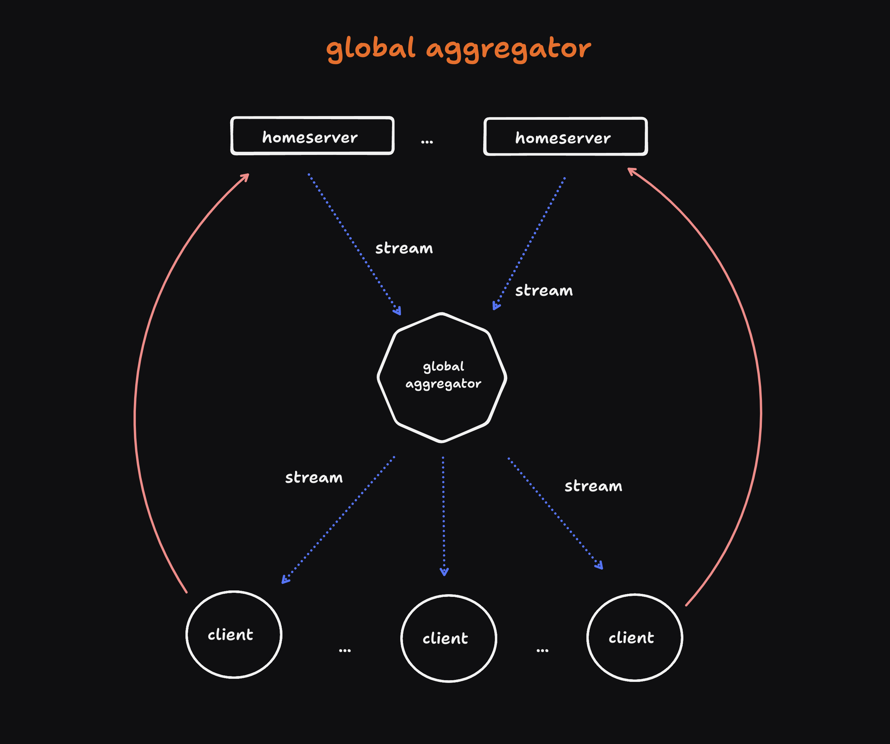

This architectural pattern implements a distributed system model centered around a global aggregation layer, eliminating the need for individual backend instances. The core component of this design is a centralized global aggregator that interfaces with multiple home servers, consuming events from each in a unified manner.

Key features of this architecture include:

1. Centralized Event Processing: The global aggregator serves as a single point of convergence for event streams originating from disparate home servers across the network.
2. Policy-Driven Filtering: The aggregator implements a configurable set of policies and filtering rules, allowing for dynamic event processing based on predefined criteria.
3. Client Flexibility and Aggregator Choice: Clients consume data from the global aggregator stream. However, if a client finds the enforced rules of one aggregator unsuitable, it retains the flexibility to switch to an alternative global aggregator that better aligns with its requirements.
4. Scalable Event Distribution: By centralizing the aggregation process, this architecture facilitates efficient event distribution to multiple clients, potentially reducing redundant processing and network overhead.