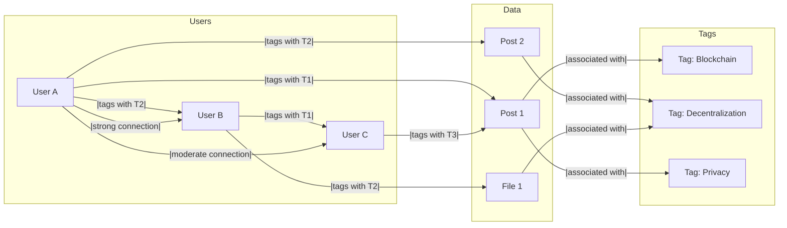

## Semantic Social Graph

A **Semantic Social Graph** represents relationships between users, content, and interactions, enriched with contextual meaning that enables better filtering, discovery, and coordination.

Imagine being able to not only see what your friends are sharing but also easily find content that matches your interests across a wide network of people you trust.

Instead of relying on a centralized platform's algorithm to decide what is relevant to you, the **Semantic Social Graph** lets you decide based on your relationships and the tags you assign to content. This is what Pubky envisions—a new way to structure social interaction on the web that empowers users with more control over their connections and content.

## Why Semantic Social Graphs are Important

Most traditional social media platforms use proprietary algorithms to determine what content to show users. These algorithms prioritize engagement, often at the cost of user autonomy and quality content. Users are left with minimal control over what they see, and these algorithms can create echo chambers or amplify misinformation.

With a **Semantic Social Graph**, the users are in control. It allows them to enrich the relationships and content they interact with by adding contextual tags, trust levels, and preferences. This means users can decide what content they want to prioritize, who they trust, and how they want to discover new information. The graph is built organically by users, not dictated by a centralized entity.

**Key examples of how Semantic Social Graphs can be used include:**

- **Filtering**: Users can create their own filters to see only content they deem valuable. For example, only seeing posts that have been tagged as trustworthy by certain friends or connections.
- **Discovery**: Instead of relying on centralized algorithms, users can discover new content based on their own semantic tags and the relationships within their network. This gives users the ability to discover information that is genuinely relevant to them.
- **Coordination**: A Semantic Social Graph also makes it easier for people to coordinate, as it allows users to form groups or match connections based on shared interests or values.

## How Pubky Implements a Decentralized Semantic Social Graph

In **Pubky**, the Semantic Social Graphs is central to providing a more open and user-first social experience.

This diagram shows how the Semantic Social Graph works in Pubky, representing users, content, and tags. Users tag content and peers, which adds context and helps determine how information flows through the network. Relationships are weighted, meaning users can specify trust levels and the strength of connections to further personalize their experience.

**Tags and Contextual Meaning**: Pubky allows users to add tags to content and connections, giving them the ability to add context to their relationships. This means users can easily categorize and prioritize content based on what matters to them most.

- **Web of Trust**: The concept of **Web of Trust** is integrated into the Semantic Social Graph. Users can assign trust levels to their connections, allowing for a more nuanced approach to content discovery and filtering. Instead of seeing content from strangers or questionable sources, users can prioritize posts from people they trust.

- **Decentralized Indexing**: Pubky provides a decentralized approach to indexing, meaning that users aren't reliant on a single entity to determine the importance or visibility of content. Users have the power to decide what they want to see and how they want their social graph to evolve.

(NOTE: During the initial bootstrapping phase of Pubky, the Semantic Social Graph may be limited until more users adopt the system. Synonym is actively building tools to make this adoption easier.)

## Web of Trust

**Web of Trust** is a decentralized trust model used in cryptography, particularly in systems like _PGP_, _GnuPG_, and other _OpenPGP_ compatible systems, to establish the authenticity of the binding between a public key and its owner, traditionally used to verify identities or build trust without central authorities.

The Web of Trust (WoT) concept was first introduced by _PGP_ creator [Phil Zimmermann](https://en.wikipedia.org/wiki/Phil_Zimmermann#PGP) in 1992. This model is an alternative to the centralized trust model of a __Public Key Infrastructure (PKI)__, which relies on a __certificate authority (CA)__ or a hierarchy of such authorities.

Web of Trust always seemed like a promising way to build decentralized trust networks, but it has limitations that have become more apparent over time. The idea of users assigning trust levels to others in their network is still useful, but trust is not a binary decision—it's nuanced, contextual, and ever-changing. While Web of Trust provides a good foundation, it lacks the flexibility required for more complex social environments.

Trust is not just about whether you trust someone or not; it's about how you trust them, in what context, and to what extent. This is why the **Semantic Social Graph** expands on the primitive idea of a Web of Trust. Instead of treating trust as a simple yes/no relationship, the Semantic Social Graph allows users to add context, weight, and tags to their connections, making it far more adaptable to real-world social dynamics.

For example, you may trust one person for their expertise in technology but not for financial advice. The Semantic Social Graph allows you to capture these nuances by adding contextual meaning and defining the type of trust you place in different connections. This makes it a more effective and precise tool for socializing reputation and controlling the flow of information.

**Web of Trust** still plays a role in Pubky by helping users assign inherent trust to connections, but it is part of a broader subjective system. With **Semantic Social Graphs**, Pubky enhances the ability of users to manage their networks with greater precision and personal relevance.

## Challenges and Considerations

- **Adoption**: The effectiveness of a **Semantic Social Graph** depends on widespread adoption. If only a few users add context to their relationships and content, the graph's utility will be limited. However, as more users participate, the graph becomes increasingly valuable.
- **Privacy**: Adding context to relationships can raise privacy concerns. Users need to be mindful of how much information they share and with whom. Pubky provides some privacy tools, but users must still be careful about the data they make public, and their public behavior.
- **Complexity**: Creating and maintaining a **Semantic Social Graph** requires interaction from users. Tagging content, assigning trust levels, and managing relationships must be implemented in useful, intrinsic ways. Pubky aims to simplify this process as much as possible through intuitive user interfaces and tools.

## Summary

The **Semantic Social Graph** is about putting users back in control of their social interactions online. Instead of relying on opaque, centralized algorithms, Pubky enables users to build their own networks based on trust, context, and shared interests. By giving users the ability to tag content, assign trust levels, and manage their relationships, Pubky aims to create a more meaningful and personalized social experience. The **Web of Trust** further enhances this by allowing users to curate their content and connections based on their own criteria, leading to a healthier, more user-driven social ecosystem.
