**Semantic Relationships:** Connections between users and content are tagged with meaningful metadata, capturing the context, relevance, and nature of each relationship.
**Weighted Connections:** Relationships aren't just binary; they carry weights that represent their strength, trust level, or relevance, enabling more sophisticated interactions.
**User-Centric Personalization:** Users have control over how they interact with the network, allowing them to tailor their experience based on their interests and connections.
**Decentralization:** There's no central authority controlling the network. Users own their identities and data, promoting privacy and sovereignty.

### Why It Matters
Enhanced Content Curation: By understanding the semantic meaning and weights of relationships, users receive content that's more relevant and engaging.
Scalability: Automated tagging and weighting mechanisms scale effortlessly, accommodating growing networks without compromising performance.
Rich Interactions: Users can engage in more meaningful ways, as the network understands the context and nuances of each relationship.

### Semantic Graphs in Pubky App

The Pubky App is a user-friendly platform that showcases the capabilities of Pubky Core and PKARR.

**Social Tagging:** Users can tag posts, files, links, and even peers with meaningful labels. This enriches the semantic content of the network.
Customizable Feeds: By utilizing tags and weighted relationships, users control what appears in their feeds, ensuring content relevance.
**Peer Tagging:** Assign semantic tags to peers, influencing how their content is weighted and displayed.
**Web of Relevance:** Move beyond the traditional Web-of-Trust paradigm to a network where relevance and context drive interactions.

### How Pubky Applies Decentralized Networking and Social Graphing
Pubky combines decentralized identity, semantic social tagging, and weighted relationships into a cohesive system that offers unparalleled user control and personalization.

**Semantic Social Graphing**
Weighted Distances: Relationships aren't just connections; they have weights that represent their strength or relevance to the user.

**Advanced Content Curation**
Personalized Feeds: Users define what content matters to them, and the network delivers it based on semantic relevance and weighted relationships.
Dynamic Filtering: Adjust your view of the network in real-time by modifying tags and weights, ensuring your feed evolves with your interests.

### Why It's Different
Pubky bridges the gap between decentralized identity management and personalized content curation, something traditional models haven't achieved.
Enhancing Privacy and Security: By eliminating centralized points of control, Pubky reduces vulnerabilities and enhances user privacy.
Promoting Open Innovation: As an open-source project, Pubky invites developers and enthusiasts to contribute, fostering a community-driven evolution of the platform.
