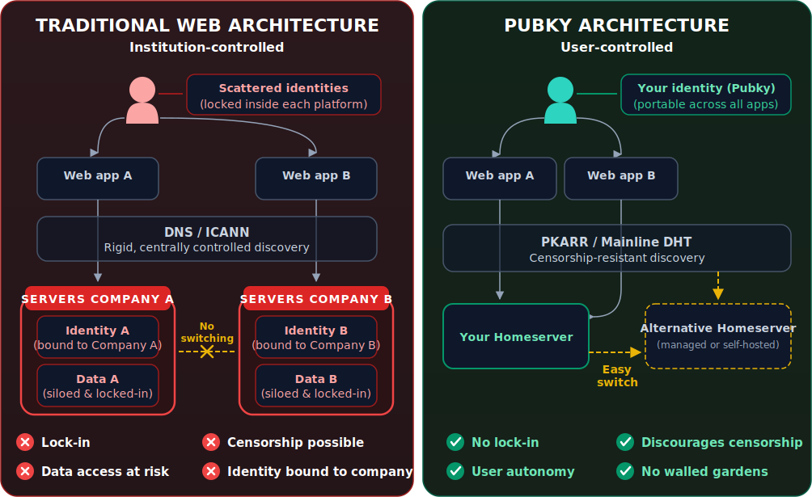

# Contributing to Pubky

Thank you for your interest in contributing to Pubky! This guide will help you get started.

---

## Ways to Contribute

### 1. Documentation

Help improve this knowledge base:
- Fix typos and errors
- Add missing information
- Improve clarity and explanations
- Add examples and tutorials
- Translate to other languages

### 2. Code Contributions

Contribute to Pubky projects:
- **[[Explore/PubkyCore/Introduction|Pubky Core]]**: Protocol and homeserver
- **[[Explore/Technologies/PubkyRing|Pubky Ring]]**: Mobile key manager
- **[[Explore/PubkyApp/Introduction|Pubky App]]**: Social application (Franky)
- **[[Explore/PubkyApp/Backend/PubkyNexus|Pubky Nexus]]**: Indexing service
- **[[Explore/Technologies/PubkyCLI|Pubky CLI]]**: Command-line tool
- **[[PKDNS]]**, **[[Homegate]]**, **[[PubkyDocker|Pubky Docker]]**: Infrastructure tools

### 3. Community Support

Help others in the community:
- Answer questions on Telegram
- Help troubleshoot issues
- Share your projects and experiences
- Write blog posts and tutorials

### 4. Testing & Bug Reports

Improve quality through:
- Testing beta features
- Reporting bugs with detailed reproduction steps
- Suggesting improvements
- Validating fixes

---

## Contributing to Documentation

### Quick Edits

For small fixes (typos, links, formatting):

1. **Fork the repository**: [github.com/pubky/pubky-knowledge-base](https://github.com/pubky/pubky-knowledge-base)
2. **Make your changes**: Edit markdown files directly
3. **Submit a pull request**: Include a clear description

### Larger Contributions

For new pages or significant changes:

1. **Discuss first**: Open an issue to discuss your plans
2. **Follow the structure**: Match existing page organization
3. **Use proper linking**: Use wiki-links `[[Page Name]]` for internal links
4. **Add to index**: Update `index.md` if adding new major pages
5. **Test locally**: Build with Quartz to verify

**Build locally:**
```bash
cd pubky-knowledge-base/quartz
npm install
npm run docs
# Visit http://localhost:8080
```

### Documentation Style Guide

**Markdown Conventions:**
- Use `# Title` for page titles (H1, only one per page)
- Use `## Section` for major sections (H2)
- Use `### Subsection` for subsections (H3)
- Use wiki-links for internal references: `[[Page Name]]`
- Use standard markdown links for external URLs: `[text](url)`

**Code Blocks:**
```javascript
// Always specify language
const example = "like this";
```

**Linking:**
```markdown
<!-- Internal (wiki-link) -->
[[Pubky Core]]
[[Explore/PubkyCore/Introduction|Pubky Core Overview]]

<!-- External -->
[Official Docs](https://pubky.github.io/pubky-core/)
```

**Images:**
```markdown
<!-- Always include descriptive alt text -->

```

---

## Contributing Code

### General Process

1. **Check existing issues**: See if someone is already working on it
2. **Open an issue**: Describe what you want to build/fix
3. **Fork and branch**: Create a feature branch
4. **Write code**: Follow project conventions
5. **Test thoroughly**: Ensure tests pass
6. **Submit PR**: Include description and link to issue

### Project-Specific Guidelines

Each repository has its own CONTRIBUTING.md:

- **Pubky Core**: [github.com/pubky/pubky-core/blob/main/CONTRIBUTING.md](https://github.com/pubky/pubky-core/blob/main/CONTRIBUTING.md)
- **Pubky Nexus**: [github.com/pubky/pubky-nexus/blob/main/CONTRIBUTING.md](https://github.com/pubky/pubky-nexus/blob/main/CONTRIBUTING.md)
- **Pubky Ring**: [github.com/pubky/pubky-ring/blob/main/CONTRIBUTING.md](https://github.com/pubky/pubky-ring/blob/main/CONTRIBUTING.md)
- **Pubky CLI**: [github.com/pubky/pubky-cli/blob/main/CONTRIBUTING.md](https://github.com/pubky/pubky-cli/blob/main/CONTRIBUTING.md)

### Code Quality Standards

**All code contributions should:**
- ✅ Pass existing tests
- ✅ Add tests for new features
- ✅ Follow language-specific style guides
- ✅ Include documentation/comments where needed
- ✅ Not introduce new linter warnings
- ✅ Be accompanied by a clear commit message

**Commit Message Format:**
```
type: brief description (max 72 chars)

Longer explanation if needed. Wrap at 72 characters.

Fixes #123
```

**Types:**
- `feat`: New feature
- `fix`: Bug fix
- `docs`: Documentation only
- `style`: Code style (formatting, no logic change)
- `refactor`: Code restructuring
- `test`: Adding or updating tests
- `chore`: Maintenance tasks

**Example:**
```
feat: add HTTPS record support to PKDNS

Implements HTTPS DNS record type handling in the PKDNS resolver,
enabling service binding records for modern applications.

Fixes #456
```

---

## Development Setup

### Pubky Core (Rust)

```bash
# Clone
git clone https://github.com/pubky/pubky-core
cd pubky-core

# Build
cargo build

# Run tests
cargo test

# Run homeserver locally
cd pubky-homeserver
cargo run

# Format code
cargo fmt

# Lint
cargo clippy
```

**Requirements:**
- Rust 1.75+
- OpenSSL development libraries

### Pubky Ring (React Native)

```bash
# Clone
git clone https://github.com/pubky/pubky-ring
cd pubky-ring

# Install dependencies
npm install
cd ios && pod install && cd ..

# Run on iOS
npm run ios

# Run on Android
npm run android

# Run tests
npm test

# Lint
npm run lint
```

**Requirements:**
- Node.js 18+
- React Native environment (Xcode for iOS, Android Studio for Android)

### Pubky Nexus (Rust)

```bash
# Clone
git clone https://github.com/pubky/pubky-nexus
cd pubky-nexus

# Start dependencies (Neo4j, Redis, PostgreSQL)
docker compose up -d neo4j redis postgres

# Build
cargo build

# Run migrations
cargo run --bin migrator

# Run server
cargo run --bin server

# Run tests
cargo test
```

**Requirements:**
- Rust 1.75+
- Docker for databases
- PostgreSQL, Neo4j, Redis

### Pubky CLI (Rust)

```bash
# Clone
git clone https://github.com/pubky/pubky-cli
cd pubky-cli

# Build
cargo build

# Install locally
cargo install --path .

# Run tests
cargo test

# Generate completions
pubky-cli tools completions bash > completions.bash
```

---

## Community Guidelines

### Code of Conduct

We expect all contributors to:

- **Be respectful**: Treat everyone with respect and kindness
- **Be collaborative**: Work together constructively
- **Be inclusive**: Welcome diverse perspectives
- **Be professional**: Keep discussions focused and productive
- **Give credit**: Acknowledge others' contributions

### Communication Channels

- **Telegram**: [t.me/pubkycore](https://t.me/pubkycore) - General discussion and support
- **GitHub Issues**: Bug reports and feature requests
- **GitHub Discussions**: Long-form conversations and proposals
- **Pull Requests**: Code review and technical discussion

### Getting Help

**Before asking:**
1. Check the [[FAQ]]
2. Search existing issues
3. Read the [[Troubleshooting]] guide
4. Review relevant documentation

**When asking:**
1. Be specific about your problem
2. Include relevant code/logs
3. Mention what you've tried
4. Specify your environment

---

## Review Process

### Documentation PRs

- Reviewed by documentation maintainers
- Usually merged within 1-3 days
- Focus on clarity, accuracy, and consistency

### Code PRs

**Review criteria:**
- Code quality and style
- Test coverage
- Performance implications
- Security considerations
- Breaking changes
- Documentation updates

**Timeline:**
- Initial review: 1-7 days
- Revisions: As needed
- Merge: After approval from maintainer(s)

**Tips for faster review:**
- Keep PRs focused and small
- Include tests
- Update documentation
- Respond to feedback promptly
- Be patient and respectful

---

## Specialized Contributions

### Writing Examples

Share practical examples:

1. **Create a repository**: Your example project
2. **Add to awesome-pubky**: Link to curated list
3. **Write a tutorial**: Blog post or documentation
4. **Record a video**: Screencast or presentation

### Building Clients

Building a Pubky App-compatible client?

1. **Use pubky-app-specs**: [npm package](https://www.npmjs.com/package/pubky-app-specs)
2. **Follow the spec**: Ensure interoperability
3. **Test against Nexus**: Use [nexus.pubky.app](https://nexus.pubky.app)
4. **Share your work**: Let the community know!

### Running Infrastructure

Contributing infrastructure:

1. **Public Homeserver**: Host for community use
2. **PKDNS Instance**: Provide DNS resolution
3. **Nexus Instance**: Run custom indexer
4. **PKARR Relay**: Improve network performance

### Translations

Help translate documentation:

1. **Choose a language**: Check what needs translation
2. **Create language folder**: e.g., `/es/` for Spanish
3. **Translate markdown files**: Maintain structure
4. **Submit PR**: Include translation credits

---

## Recognition

### Contributors

All contributors are recognized in:
- Repository README files
- Release notes for significant contributions
- Community shout-outs

### Maintainers

Consistent, high-quality contributors may be invited to become maintainers with:
- Merge permissions
- Release authority
- Architecture input

---

## License

By contributing to Pubky projects, you agree that your contributions will be licensed under the MIT License (or the project's specific license).

**MIT License Basics:**
- ✅ Commercial use allowed
- ✅ Modification allowed
- ✅ Distribution allowed
- ✅ Private use allowed
- ⚠️ No warranty provided

---

## Getting Started Checklist

Ready to contribute? Here's your checklist:

**For Documentation:**
- [ ] Fork pubky-knowledge-base repository
- [ ] Make your changes
- [ ] Test locally with Quartz
- [ ] Submit pull request

**For Code:**
- [ ] Check project's CONTRIBUTING.md
- [ ] Set up development environment
- [ ] Create feature branch
- [ ] Write code and tests
- [ ] Pass all checks (lint, test, build)
- [ ] Submit pull request

**For Community:**
- [ ] Join Telegram channel
- [ ] Introduce yourself
- [ ] Answer questions where you can
- [ ] Share your projects

---

## Questions?

- **Documentation**: Open an issue on [pubky-knowledge-base](https://github.com/pubky/pubky-knowledge-base/issues)
- **Code**: Check project-specific issues
- **General**: Ask on [Telegram](https://t.me/pubkycore)

---

**Thank you for contributing to Pubky! Together we're building a decentralized, censorship-resistant web. 🚀**

