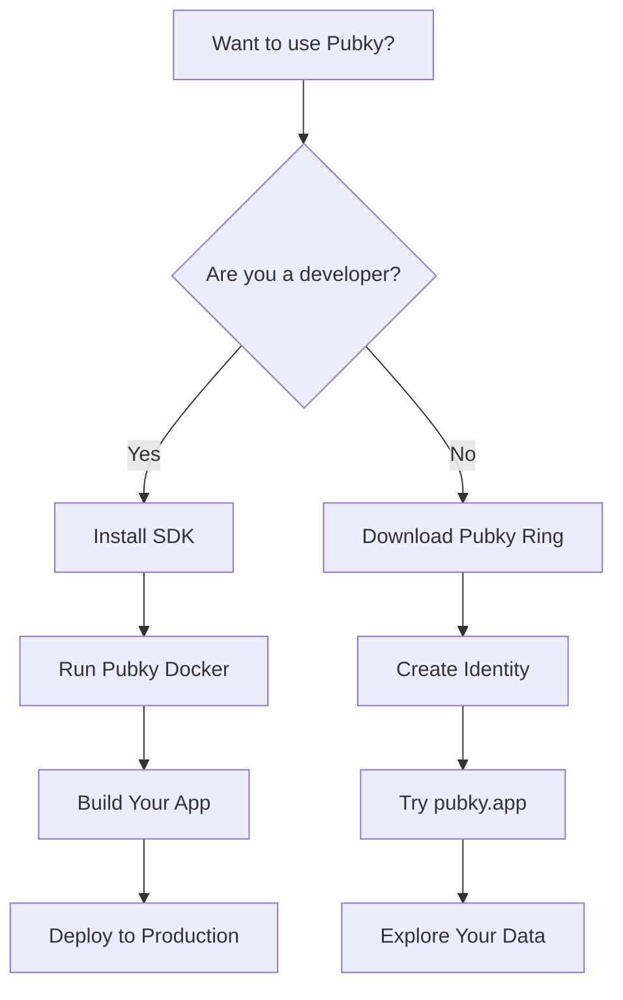

# Getting Started with Pubky

Welcome to Pubky! This guide will help you get started whether you're a user looking to try decentralized social media or a developer building on the Pubky protocol.



---

## For Users: Experience Decentralized Social Media

### Step 1: Download Pubky Ring

**[[Explore/Technologies/PubkyRing|Pubky Ring]]** is your key manager for the Pubky ecosystem. It securely stores your identity and authorizes apps.

- **iOS**: Download from the App Store
- **Android**: Download from Google Play

🔗 [Official Repository](https://github.com/pubky/pubky-ring)

### Step 2: Create Your First Pubky (Identity)

1. Open Pubky Ring
2. Follow the onboarding flow to generate your key pair
3. **Save your recovery phrase securely** - this is your master backup
4. Your public key (pubky) is now your permanent identity!

**Important**: Your pubky looks like: `z4e8s17cou9qmuwen8p1556jzhf1wktmzo6ijsfnri9c4hnrdfty`

### Step 3: Try Pubky App

Visit **[pubky.app](https://pubky.app)** - a decentralized social media platform built on Pubky.

1. Click "Sign In" or "Create Account"
2. Authorize Pubky App through Pubky Ring
3. Create your profile
4. Start posting, following, and exploring!

**What makes it different:**
- You own your data (stored on homeservers)
- No algorithm controls your feed
- You can switch to different apps without losing your content
- True censorship resistance

### Step 4: Explore Your Data

Use **[[Explore/Technologies/PubkyExplorer|Pubky Explorer]]** ([explorer.pubky.app](https://explorer.pubky.app)) to browse your data:

1. Enter your pubky or navigate to a path
2. Browse your files and directories
3. See exactly what data you've published
4. Share direct links to your public data

**Example paths:**
- `pubky://your-key/pub/pubky.app/profile.json` - Your profile
- `pubky://your-key/pub/pubky.app/posts/` - Your posts directory

### Next Steps for Users

- **Join the community**: [Telegram](https://t.me/pubkycore)
- **Learn more**: Read the [[FAQ]]
- **Understand the tech**: Check out [[Explore/PubkyCore/ELI5|ELI5: Pubky Core]]
- **Explore concepts**: Learn about [[SemanticSocialGraph|Semantic Social Graph]]

---

## For Developers: Build on Pubky

### Step 1: Install the SDK

Choose your platform and install the [[Explore/PubkyCore/SDK|Pubky SDK]]:

**Rust:**
```bash
cargo add pubky
```

**JavaScript/TypeScript (Web & Node.js):**
```bash
npm install @synonymdev/pubky
# or
yarn add @synonymdev/pubky
```

**React Native:**
```bash
npm install @synonymdev/react-native-pubky
cd ios && pod install  # iOS only
```

**iOS/Android Native**: See [[Explore/PubkyCore/SDK|SDK Documentation]] for UniFFI bindings via `pubky-core-ffi`.

📚 **Resources:**
- [Rust API Docs](https://docs.rs/pubky)
- [NPM Package](https://www.npmjs.com/package/@synonymdev/pubky)
- [Official Docs](https://pubky.github.io/pubky-core/)

### Step 2: Run Local Development Stack

Use **[[Explore/Technologies/PubkyDocker|Pubky Docker]]** to run the complete Pubky ecosystem locally:

```bash
# Clone the repository
git clone https://github.com/pubky/pubky-docker
cd pubky-docker

# Configure environment (testnet recommended for development)
cp .env.example .env
# Edit .env to set ENVIRONMENT=testnet

# Start the stack
docker compose up -d
```

This gives you:
- PKARR relay (port 6881)
- Homeserver with PostgreSQL (port 4173)
- Pubky Nexus with Neo4j & Redis (port 8000)
- Pubky App frontend (port 5173)

**Alternative**: Run just a homeserver:
```bash
git clone https://github.com/pubky/pubky-core
cd pubky-core/pubky-homeserver
cargo run
```

### Step 3: Build Your First App

**Quick Example (JavaScript):**

```javascript
import { Pubky } from '@synonymdev/pubky';

// Create client
const pubky = await Pubky.create();

// Generate a new identity (signup)
const { publicKey, secretKey } = await pubky.signUp();
console.log('Your pubky:', publicKey);

// Store data
await pubky.put('/pub/myapp/profile', JSON.stringify({
  name: "Alice",
  bio: "Building on Pubky!",
  avatar: "https://example.com/avatar.jpg"
}));

// Retrieve data
const profile = await pubky.get('/pub/myapp/profile');
console.log('Profile:', JSON.parse(profile));

// List directory
const files = await pubky.list('/pub/myapp/');
console.log('Files:', files);

// Sign out
await pubky.signOut();
```

**Key concepts:**
- Data is stored per public key on homeservers
- Path structure: `/pub/app-name/path` for public data
- All operations use standard HTTP/HTTPS
- Authentication via cryptographic signatures

📖 **Full SDK guide**: [[Explore/PubkyCore/SDK|SDK Documentation]]

### Step 4: Explore Example Apps

Learn from working examples:

**Social App (Pubky App Specs):**
- [pubky-app-specs](https://github.com/pubky/pubky-app-specs) - Data models for social features
- [npm: pubky-app-specs](https://www.npmjs.com/package/pubky-app-specs) - Validation schemas

**CLI Tool:**
- [[Explore/Technologies/PubkyCLI|Pubky CLI]] - Reference implementation for user/admin operations
- [Source](https://github.com/pubky/pubky-cli)

**Simple Examples:**
- [pubky-core/examples](https://github.com/pubky/pubky-core/tree/main/examples) - Rust examples
- Authentication flows
- Data storage patterns

### Step 5: Integrate Advanced Features

**Use Pubky Nexus for Social Features:**

If building a social app, leverage [[Explore/PubkyApp/Backend/PubkyNexus|Pubky Nexus]] for:
- Real-time feeds and timelines
- Search and discovery
- User recommendations
- Notifications

```javascript
// Query Nexus API
const response = await fetch('https://nexus.pubky.app/v0/feeds/global');
const posts = await response.json();
```

📊 [Nexus API Docs](https://nexus.pubky.app/swagger-ui/)

**Add Payments (WIP):**

[[Explore/Technologies/Paykit|Paykit]] protocol (work in progress) will enable:
- Payment discovery via public keys
- Bitcoin/Lightning integration
- Subscriptions and monetization

**Add Encryption (WIP):**

[[Explore/Technologies/PubkyNoise|Pubky Noise]] (work in progress) provides:
- Encrypted peer-to-peer channels
- Private messaging
- Secure data sharing

### Step 6: Deploy to Production

**Deploy a Homeserver:**

1. Set up a server (VPS, cloud, or self-hosted)
2. Configure HTTPS (required)
3. Deploy homeserver:
   ```bash
   docker build --build-arg TARGETARCH=x86_64 -t pubky:core .
   docker run --network=host -it pubky:core
   ```
4. Publish homeserver location to PKARR
5. Configure rate limiting and moderation

📘 **Guide**: [[Homeserver|Homeserver Documentation]]

**Signup Verification:**

Use [[Homegate]] to prevent spam:
- SMS verification (rate-limited per phone)
- Lightning payment verification
- Open-source and self-hostable

**DNS Resolution:**

Run a [[PKDNS]] server for your users:
- Resolves public key domains
- Supports traditional DNS
- DoH/DoT encryption

### Next Steps for Developers

- **Read the docs**: [[Explore/PubkyCore/Introduction|Pubky Core Overview]]
- **Study the architecture**: [[Architecture|Architecture Overview]]
- **Join the community**: [Telegram](https://t.me/pubkycore)
- **Check the FAQ**: [[FAQ]]
- **Review comparisons**: [[Comparisons]] with other protocols
- **Troubleshooting**: [[Troubleshooting]] guide

---

## Common First Questions

**Q: Do users need to download Pubky Ring to use my app?**
A: Currently yes for secure key management, though apps can implement their own key storage. Pubky Ring provides the best UX for multi-app identity.

**Q: Can I use Pubky without running my own homeserver?**
A: Yes! Users can choose any public homeserver provider. You can host your own or use existing providers.

**Q: Is Pubky compatible with Nostr/Bluesky/etc?**
A: Not directly. Pubky uses a different architecture (homeservers + PKARR vs relays/PDSs). See [[Comparisons]] for details.

**Q: How do I handle user authentication?**
A: The SDK handles it automatically via signature-based auth. No passwords, OAuth, or tokens needed. See [[Authentication]].

**Q: Can I build private apps?**
A: Currently Pubky is optimized for public data. Private/encrypted features are coming via [[Explore/Technologies/PubkyNoise|Pubky Noise]].

**Q: How do I make money?**
A: Several models work: homeserver hosting, indexing services (like Nexus), premium features, or payments via [[Explore/Technologies/Paykit|Paykit]] (WIP).

---

## Resources

### Documentation
- **[[index|Main Documentation]]**: Complete knowledge base
- **[[Glossary]]**: Quick term reference
- **[[FAQ]]**: 63+ questions answered
- **[[TLDR]]**: 30-second overview

### Technical
- **[[Explore/PubkyCore/API|API Reference]]**: HTTP API spec
- **[[Explore/PubkyCore/SDK|SDK Guide]]**: Client library docs
- **[Rust Docs](https://docs.rs/pubky)**: Rust crate documentation
- **[Official Docs](https://pubky.github.io/pubky-core/)**: Protocol specification

### Tools
- **[[Explore/Technologies/PubkyDocker|Pubky Docker]]**: Local development stack
- **[[Explore/Technologies/PubkyCLI|Pubky CLI]]**: Command-line interface
- **[[Explore/Technologies/PubkyExplorer|Pubky Explorer]]**: Data browser

### Community
- **Telegram**: [t.me/pubkycore](https://t.me/pubkycore)
- **GitHub**: [github.com/pubky](https://github.com/pubky)
- **Live App**: [pubky.app](https://pubky.app)

---

**Ready to build the decentralized web? Start with the [[Explore/PubkyCore/SDK|SDK]]!**

