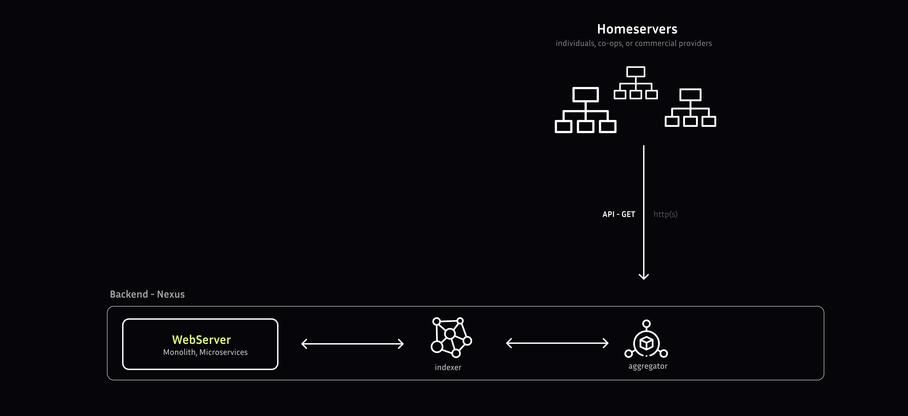

The Backend is responsible for collecting ([[Aggregator|aggregators]]) and organizing ([[Indexer|indexer]]) data from various sources, known as [[Homeservers|homeservers]].

Imagine you're trying to find a specific document in a large library. The backend is like a librarian who searches through the shelves, finds the right documents, and prepares them for you to use. This ensures that the data is accurate, up-to-date, and in a format that's easy to work with.

### Main components

- [[Aggregator|Aggregators]] execute a **data retrieval protocol** to obtain data from **data storage**, initiating a process that retrieves and collects data from various sources.
- [[Indexer|Indexers]] receive aggregated data from the **Aggregators** and initiate a rigorous **data normalization** process, transforming and converting the data into a standardized format to ensure consistency and accuracy.
- [[Web Server|Web servers]] provide the requested data to [[Pubky App/Client/Introduction|Pubky client]]
