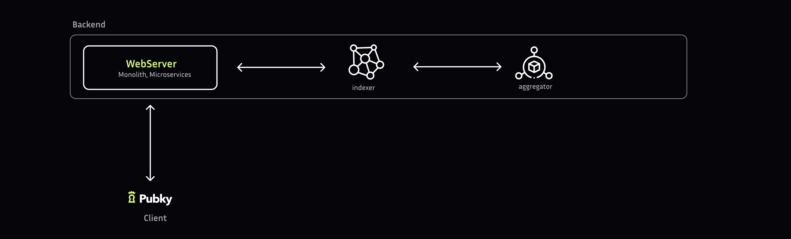

> Synonym will be initially hosting: [[Pubky Core/Homeservers|homeserver]] and [[Pubky App/Introduction|Pubky App]]

## Overview

Pubky-app's initial focus is building a decentralized social media protocol.

## Key aspects

- **Data Ownership**: Users have full autonomy over their data, hosting it on **independent [[Pubky Core/Homeservers|homeservers]]** that are decentralized and distributed across the network. This approach enables users to maintain **control** and **ownership** of their data, while also ensuring **data sovereignty** and **privacy**. 
- **Profiles**: The system employs a **decentralized data storage** approach, where **post**, **comment**, and **like** data are stored in association with **user profiles**.
- [[Aggregator|Aggregators]] collecting social graphs
- Feeds of followings' activities
- [[Search|Searching]] profiles and posts
- Notification delivery through [[Pubky App/Backend/Introduction|aplication backends]] 
- Distributed moderation through user blocking

## Components

The Pubky App is a complex system that can be broken down into two main components: the [[Pubky App/Backend/Introduction|backend]] and the [[Pubky App/Client/Introduction|client]]. These two pieces work together to provide a seamless user experience.

##### Backend: The Data Organizer

It collects and organizes data from various sources, processing it into a usable format.

##### Client: The User Interface

It is the part of the Pubky App that you interact with directly. It's responsible for taking the organized data from the Backend and presenting it to you in a visually appealing and easy-to-understand way.

## MVP Architecture

The early versions of Pubky app take some shortcuts over the [[Pubky Core/Introduction|Pubky Core]] design. The MVP app is centralized, therefore we saved time and complexity by aggregating functionality into fewer components. The main two components are the `Homeserver` and the `Indexer`

- The [[Homeservers|homeservers]] fulfils the function of `data stores`, republishing users keys to [[0.Introduction|Pkarr]] and it acts also as an identity-provider (Oauth-like sign-in). Users maintain a trust relationship with the homeserver.
- The `Indexer` fulfils the function of the [[Pubky App/Backend/Introduction|backend]] for the Pubky App. 
