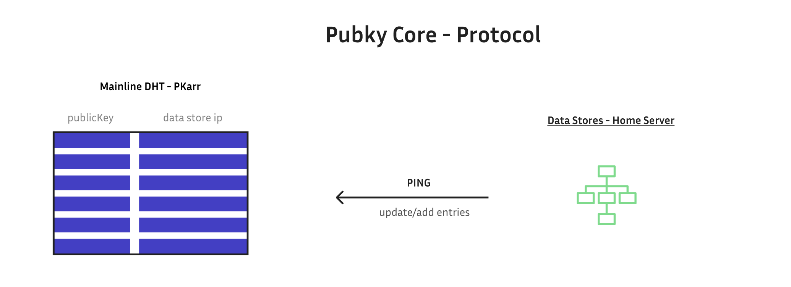

## Pubky Core Overview

Pubky Core is built on a few core concepts:

- **[[Data Stores|Data Stores]]** - Decentralized data storage nodes that host user data. Data is encrypted at rest.

- **[[0.Introduction|Pkarr]]** - Self-issued public keys that function as sovereign, publicly addressable domains are used to resolve the previous components.

Pubky Core's distributed architecture aims to provide user autonomy through [[3.Credible Exit|credible exit]] between interchangeable components.

## Target Users

Pubky Core is made for developers and builders of internet software products. We will actively work to cultivate a community of builders and startups using our tech.

[[PubKy App/Introduction|Pubky App]] is made for anyone interested in social media and online publishing that wants new ways to control their data and more control over which posts they see.

## Why? What is the reward?

The reward for everyone is a more open, privacy-focused, usable, modular and secure web. The reward for [Synonym](https://synonym.to/) is to be positioned to disrupt Big Tech as an industry, gaining user recognition and reputation through the effort of building a decentralized ecosystem. The ultimate potential is for [Synonym](https://synonym.to/) to become a major player in online publishing & social media, while also monetizing in ways similar to Google, as well as opportunities to introduce new users to our ecosystem of products and services.
