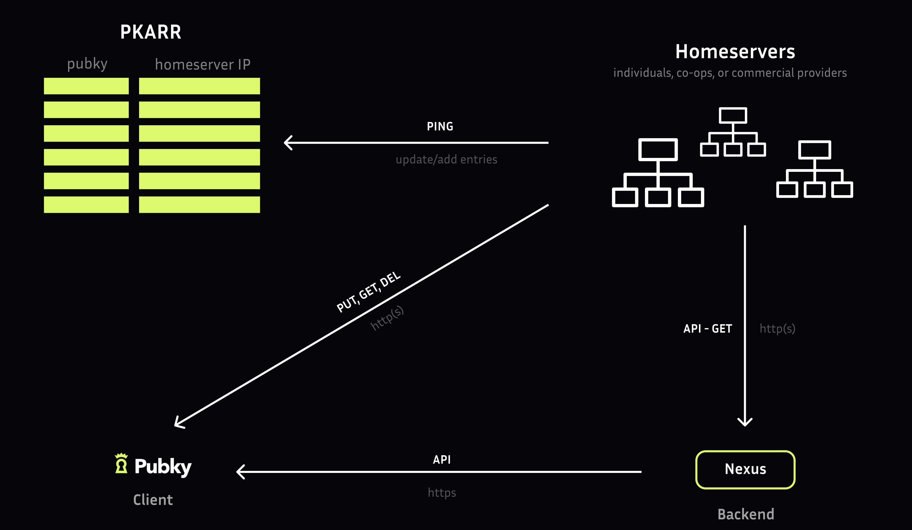

### Pubky App

[[Explore/Pubky App/Introduction|Pubky App]] is an open-source web application that helps users publish and consume Pubky homeserver data within a user experience that merges the features of popular social media, search, and publishing apps.

Architecture overview.

