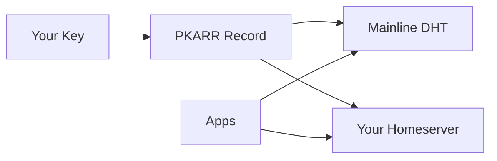

# Pubky: 30-Second Overview

**Pubky is a decentralized web protocol that puts you in control of your identity and data.**

## What It Is

- **Your Identity = Your Key**: No usernames, no accounts. Your public key is your permanent identity.
- **Your Data, Your Choice**: Store data on any homeserver you choose. Switch anytime without losing anything.
- **Censorship Resistant**: Built on the Mainline DHT (15+ years proven, 10M+ nodes). No single authority can block you.
- **No Blockchain**: Fast, free operations using standard web technologies (HTTP/HTTPS).

## How It Works

1. Generate a cryptographic key pair (your identity)
2. Publish a PKARR record to the DHT (points to your homeserver)
3. Store your data on any homeserver
4. Apps discover and access your data via your public key

## Key Components

| Component | Purpose | Status |
|-----------|---------|--------|
| **[[Explore/Pubky Core/Introduction\|Pubky Core]]** | Protocol, homeserver, SDK | ✅ Production |
| **[[Explore/Technologies/Pubky Ring\|Pubky Ring]]** | Mobile key manager (iOS/Android) | ✅ Production |
| **[[Explore/Pubky App/Introduction\|Pubky App]]** | Social media demo ([pubky.app](https://pubky.app)) | ✅ Live (MVP) |
| **[[Explore/Pubky App/Backend/Pubky Nexus\|Pubky Nexus]]** | Social indexing service | ✅ Production |
| **[[Explore/Technologies/Paykit\|Paykit]]** | Payment protocol | ⚠️ WIP |
| **[[Explore/Technologies/Pubky Noise\|Pubky Noise]]** | Encrypted communication | ⚠️ WIP |

## Why It Matters

**Replace Big Tech**: No algorithm controls your feed. No company owns your data.

**Replace Big State**: Censorship becomes impractical when data lives on millions of distributed nodes.

**Replace Big Banks**: Native integration with Bitcoin/Lightning for true financial freedom (coming soon).

## Get Started

- **Users**: Download [[Explore/Technologies/Pubky Ring|Pubky Ring]] → Try [pubky.app](https://pubky.app)
- **Developers**: Check [[Getting Started|Getting Started Guide]] → Install [[Explore/Pubky Core/SDK|SDK]]

## Learn More

- **[[index|Full Documentation]]**: Complete knowledge base
- **[[FAQ|FAQ]]**: 63 questions answered
- **[[Glossary|Glossary]]**: Quick term definitions
- **[[The vision of Pubky|Vision]]**: Why we're building this

---

**Bottom Line**: Pubky gives you a self-sovereign identity, censorship-resistant data storage, and the freedom to choose your own infrastructure—all using proven, scalable technology.
