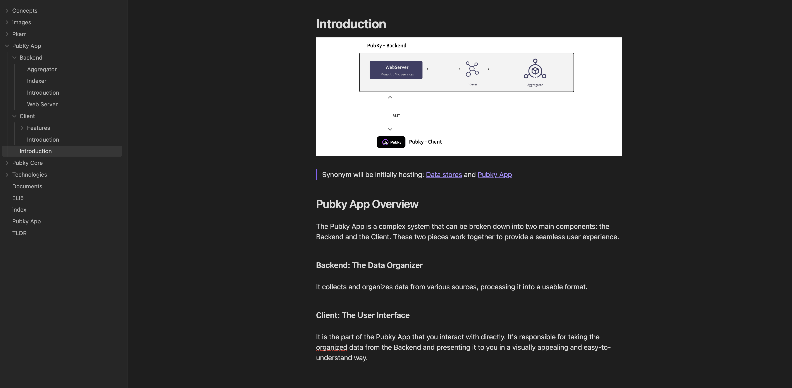
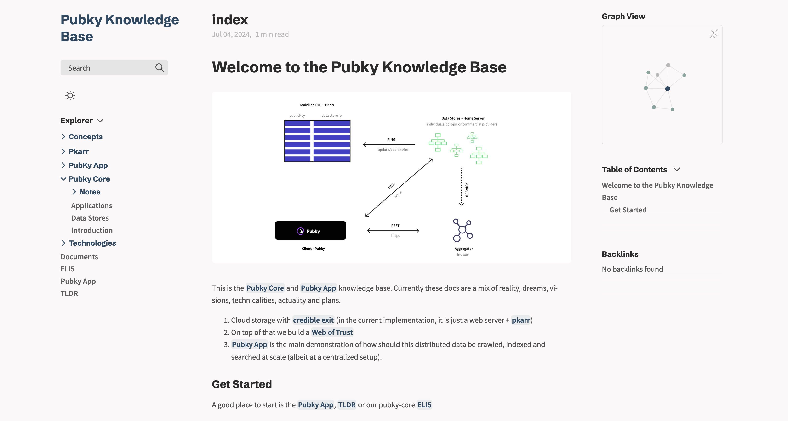

> **The current Knowledge base is a mix of reality, dreams, visions, actuality and plans.**

When accessing the documentation on GitHub, please be aware that the content may not be fully represented. To ensure a comprehensive understanding of the _Pubky Knowledge Base_, we recommend importing the data into __Obsidian__ or __Quartz__ site. This will enable you to access the complete range of information and features available in the repository.

The following blocks provide step-by-step guidance on how to import the _Pubky Knowledge Base_.
## Obsidian

The root directory is an [Obsidian Vault](https://help.obsidian.md/Getting+started/Create+a+vault#Open+existing+folder).
1. Download [Obsidian](https://obsidian.md/) app
2. Add a new vault selecting the folder path

## Build static Quartz site

For those who prefer to render the documentation directly in their browser, a preliminary step is required. To facilitate this, please ensure that [NodeJS](https://nodejs.org/en/download/prebuilt-installer) is installed on your system

1. Enter in the terminal to the project root and access to the `/quartz` directory (`cd quartz`)
2. Install dependencies with `npm install`
3. Finally build the site with `npm run docs` and check it out at [localhost:8080](http://localhost:8080/)

